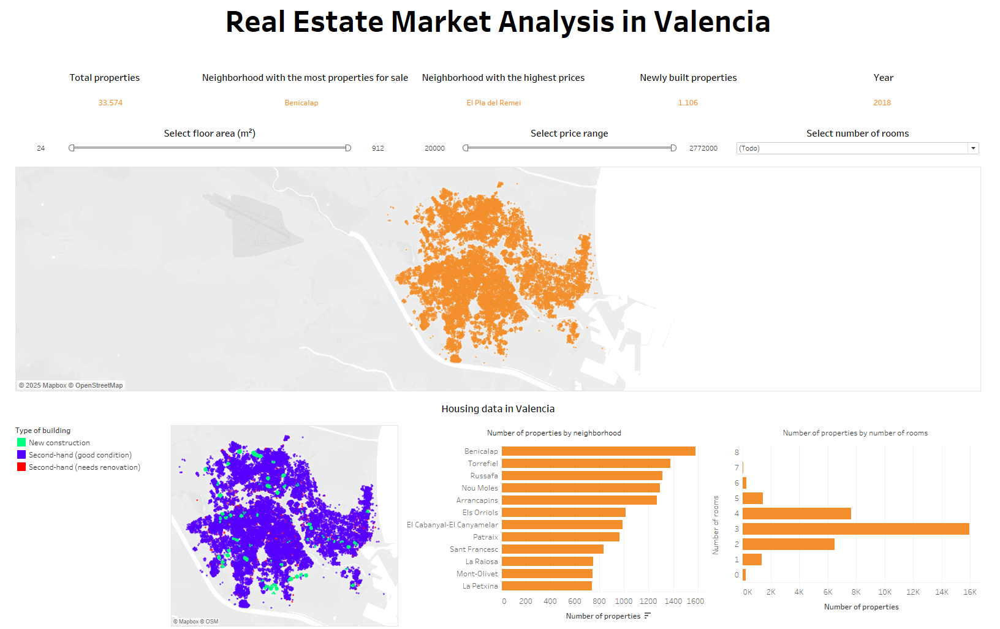
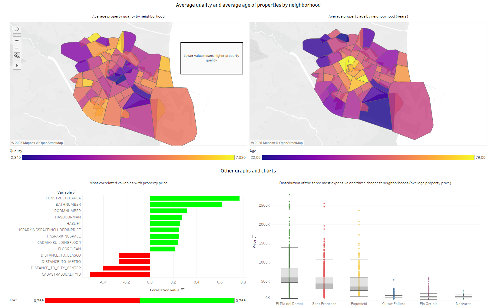

# 🏙️ Valencia Housing Market Visualization

This project analyzes the real estate market in the city of Valencia using **data visualization, data mining, and interactive dashboards**.  
The goal was to explore key questions about **housing prices, quality, age of properties, and geographical distribution** by transforming raw datasets into clear and interactive insights.

> 📊 Built with Python (pandas, plotly, geopandas, shapely), Tableau, and R.

---

## 📂 Project Structure

```text
valencia-housing-visualization/
├─ dashboard_tableau/                  # Tableau dashboard (.twb, .pdf, showcase images)
├─ data/                               # Processed datasets
├─ graphs/                             # Static graphs generated in notebooks
├─ raw-data/                           # Raw original datasets (ignored in .gitignore)
├─ src/                                # Python scripts for preprocessing and analysis
├─ real_estate_analysis_valencia.ipynb # Main Jupyter notebook
├─ requirements.txt                    # Dependencies
└─ README.md                           # Project documentation
```

---

## 🔎 Data Sources
- **Valencia real estate listings** (33,000+ properties) from [Idealista dataset](https://github.com/paezha/idealista18).  
- **Cadastral and geographic data** of Valencia neighborhoods.  
- Processed into `.csv` / `.xlsx` for reproducibility.  

---

## ⚙️ Methodology
We followed the **seven phases of data visualization**:

1. **Acquisition** – Collecting raw real estate and cadastral data.  
2. **Formatting** – Cleaning, renaming variables, and ensuring compatibility.  
3. **Filtering** – Removing nulls, outliers, and irrelevant records.  
4. **Mining** – Statistical analysis, correlations, clustering, and spatial analysis.  
5. **Representation** – Initial visualizations (maps, bar plots, boxplots).  
6. **Refinement** – Improved color palettes, labels, layout, and consistency.  
7. **Interaction** – Implementing filters, tooltips, and interactive dashboards in Tableau.  

---

## 📊 Results & Visualizations

### Tableau Interactive Dashboard




- Explore price ranges, property quality, and spatial distributions interactively.  
- Identify neighborhood clusters: exclusive, emerging, and affordable areas.  

---

## 🧾 Main Insights
- **Central premium**: central neighborhoods are the most expensive and oldest.  
- **Quality paradox**: properties with higher cadastral quality (lower numeric value) tend to be more expensive.  
- **Transport effect**: prices increase near metro stations and the city center.  
- **Clustering**: neighborhoods can be grouped into **exclusive, emerging, and economic** zones.  

---

## 🚀 How to Run
1. Clone this repository:
   ```bash
   git clone https://github.com/yourusername/valencia-housing-visualization.git
   cd valencia-housing-visualization

## ▶️ How to Open the Tableau Dashboard

1. Make sure you have **Tableau Desktop** (or Tableau Public) installed.  
   - [Download Tableau Public](https://public.tableau.com/s/download) (free).  

2. Clone this repository and navigate to the project folder:
   ```bash
   git clone https://github.com/yourusername/valencia-housing-visualization.git
   cd valencia-housing-visualization/dashboard_tableau

